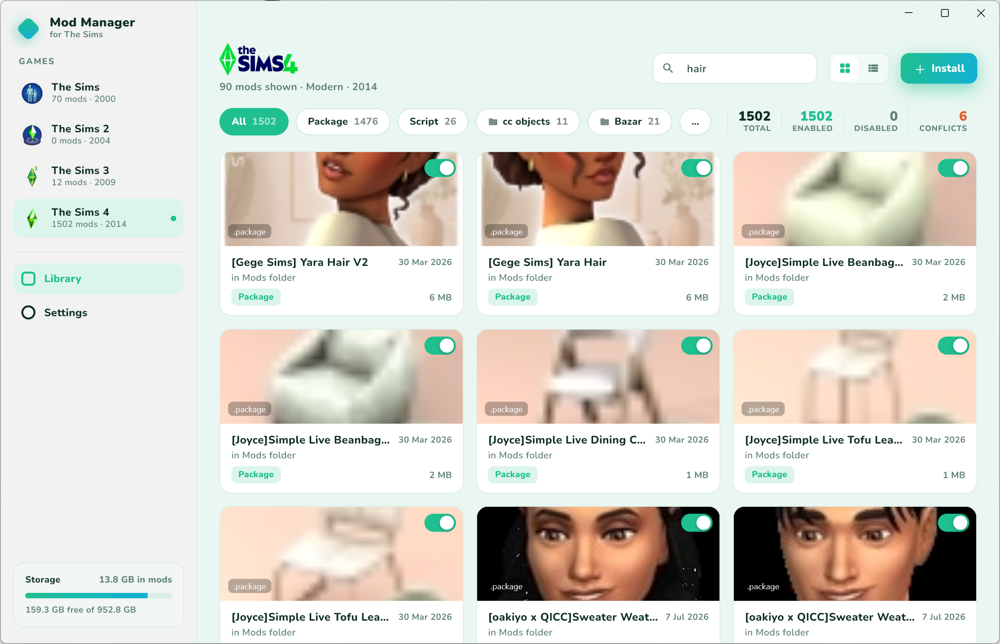
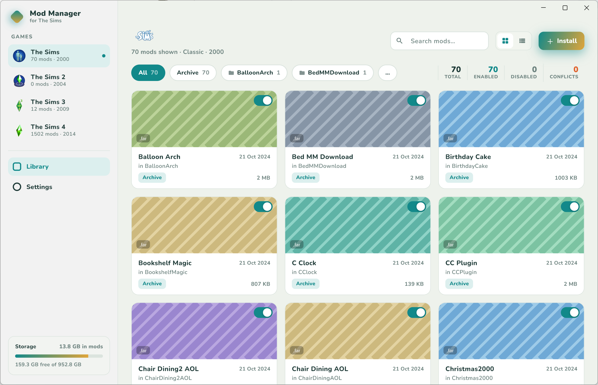

<div align="center">

# The Sims Mod Manager

**A free, cross-platform desktop mod manager for The Sims 1, 2, 3 & 4.**

[](https://github.com/rodrifelix99/TheSimsModManager/releases/latest)
[](https://github.com/rodrifelix99/TheSimsModManager/actions/workflows/release.yml)
[](https://github.com/rodrifelix99/TheSimsModManager/releases)
[](#-download)
[](LICENSE.md)
[](https://www.paypal.com/donate/?hosted_button_id=UFSLDMGKB9R6A)

**[✨ Visit the website →](https://rodrifelix99.github.io/TheSimsModManager/)**

Browse, install, enable/disable, and clean up your mods and custom content —
for every mainline Sims game, in one app, with a UI that re-themes itself to
match the game you're managing.



<sub>The UI re-themes per game — here's the same library managing The Sims 1:</sub>



</div>

## ✨ Features

- 🎨 **Per-game themed UI** — the whole app re-tints as you switch between
  The Sims 1, 2, 3 and 4, complete with the classic Sims 1 UI sounds.
- 🖼️ **Real thumbnails & insights** — `.package` files are parsed (DBPF) to
  pull out embedded artwork and a content breakdown (CAS parts, textures,
  tuning…), so your library looks like a library, not a file list.
- 🔍 **Library** with search, category filters (Package/Script/Object/…),
  grid and list layouts, and live Total/Enabled/Disabled/Conflicts stats.
- 🔀 **One-click enable/disable** — disabling renames the file with a
  `.disabled` suffix so the game's loader skips it; nothing is ever deleted.
- ⚠️ **Conflict warnings** — enabled mods sharing a file name are badged
  (duplicate installs are the most common real-world conflict).
- 🧭 **Robust folder detection** — finds localized user folders
  ("Los Sims 3", "Die Sims 2", the Ultimate Collection), lists every install
  when a game exists more than once, and lets you point at any folder
  manually.
- 🏗️ **Mods-folder scaffolding** — if a game has no mods folder yet, the app
  creates it *with the files the game needs* (e.g. the Sims 3
  `Resource.cfg` framework).
- 📦 **Install** — pick mod files (filtered to the game's real extensions)
  and they're copied into the right place.

## 📥 Download

Grab the latest version from the
**[Releases page](https://github.com/rodrifelix99/TheSimsModManager/releases/latest)** — free, no account needed.

| Platform | File | Notes |
| --- | --- | --- |
| **Windows** (installer) | `TheSimsModManager-x.y.z-windows-setup.exe` | Recommended. SmartScreen may warn (app isn't code-signed yet) — *More info → Run anyway* |
| **Windows** (portable) | `TheSimsModManager-x.y.z-windows-portable.zip` | Extract anywhere, run `sims_mod_manager.exe` |
| **macOS** | `TheSimsModManager-x.y.z-macos.zip` | Not notarized yet — right-click the app → *Open* the first time |
| **Linux** | `TheSimsModManager-x.y.z-linux-x64.tar.gz` | Extract, run `sims_mod_manager` |

## 🕹️ Supported games

| Game | Default mods location | Notes |
| --- | --- | --- |
| The Sims | `<install>\The Sims\Downloads` | Lives in the install folder, not Documents |
| The Sims 2 | `Documents\EA Games\The Sims 2\Downloads` | Ultimate Collection uses its own folder name |
| The Sims 3 | `Documents\Electronic Arts\The Sims 3\Mods\Packages` | Needs the `Resource.cfg` framework — the app creates it for you |
| The Sims 4 | `Documents\Electronic Arts\The Sims 4\Mods` | Created by the game on first launch; enable CC/script mods in game options |

All of these are best-effort defaults — every game's folder can be overridden
in Settings, which covers custom drives, localized folder names,
OneDrive-relocated Documents, and Wine/CrossOver prefixes on macOS/Linux.

The core is game-agnostic by design: support for the **SimCity** series — and
any other moddable game — can be added without touching the rest of the app.
See [docs/adding-a-game.md](docs/adding-a-game.md).

## 🧰 Building from source

Requires the [Flutter SDK](https://docs.flutter.dev/get-started/install) with
desktop support enabled.

```sh
flutter pub get
flutter run -d windows   # or: -d macos / -d linux
```

Run the tests and analyzer with `flutter test` and `flutter analyze`.
More detail in [docs/architecture.md](docs/architecture.md).

## 🤝 Contributing

Bug reports, feature ideas, and pull requests are very welcome — see
[CONTRIBUTING.md](.github/CONTRIBUTING.md). Good first stops:

- 📚 The **[Wiki](https://github.com/rodrifelix99/TheSimsModManager/wiki)** — user guide & FAQ
- 🏛️ [docs/architecture.md](docs/architecture.md) — how the app is put together
- 🎮 [docs/adding-a-game.md](docs/adding-a-game.md) — add support for a new game

## 🗺️ Roadmap

Drag-and-drop install · `.zip` extraction · deep (resource-level) conflict
detection · SimCity support. See the
[open issues](https://github.com/rodrifelix99/TheSimsModManager/issues) for
what's planned and to suggest more.

## 📄 License & disclaimer

The source is available for reading and contributing, but this is **not** an
open-source license — the code may not be reused or redistributed. The app
itself is free to download and use. See [LICENSE.md](LICENSE.md).

> **The Sims Mod Manager is an unofficial fan project.** It is not affiliated
> with, endorsed by, or sponsored by Electronic Arts Inc. or Maxis. *The
> Sims*, *SimCity*, and all related logos, artwork, and sounds are trademarks
> or copyrighted material of Electronic Arts Inc. and are used here for
> identification and interoperability only.
