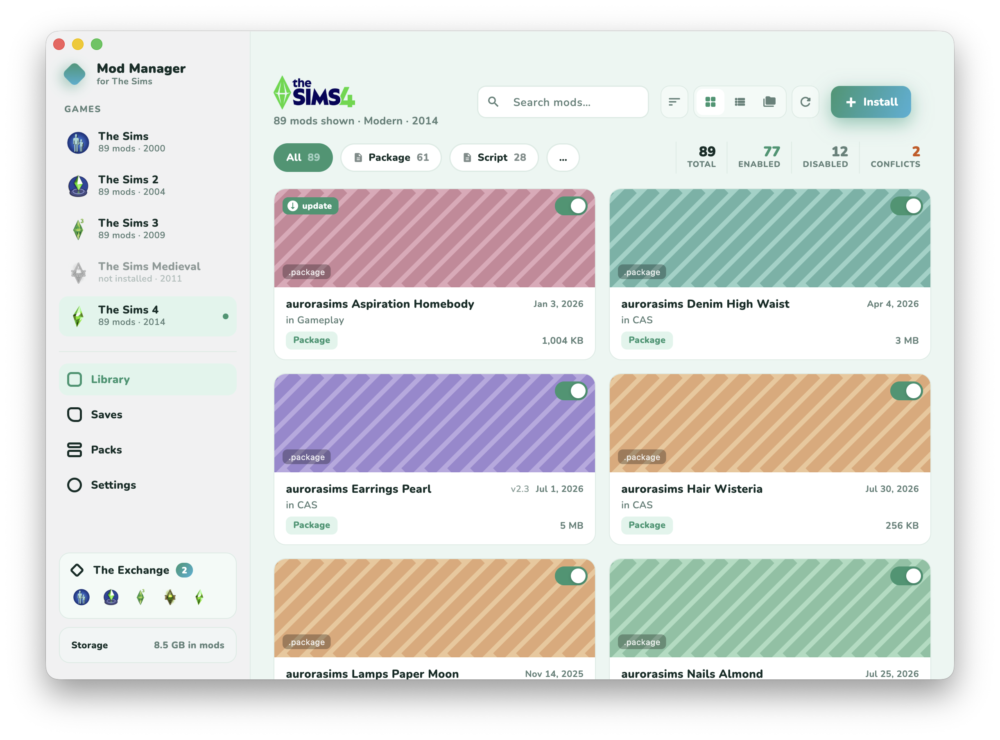
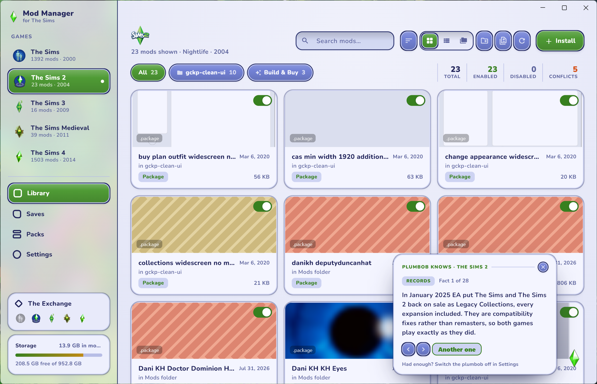
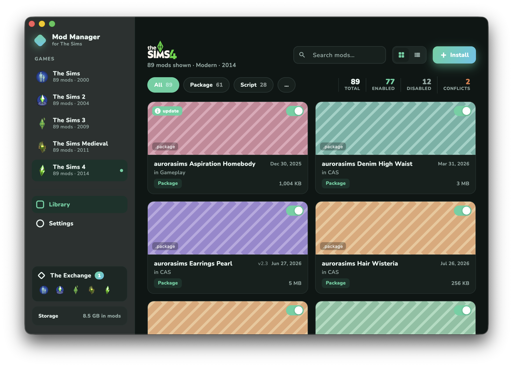
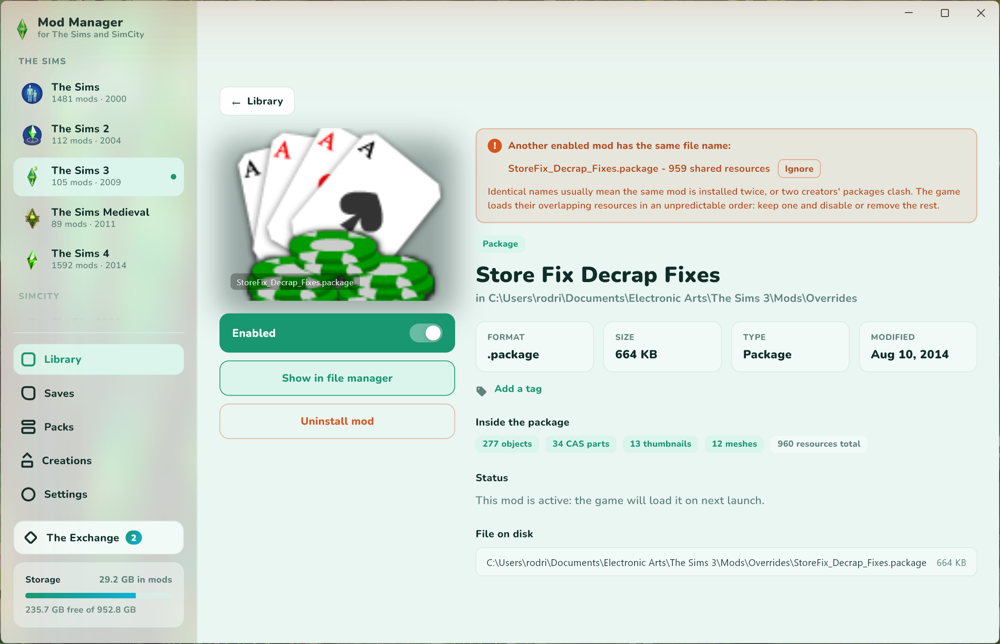
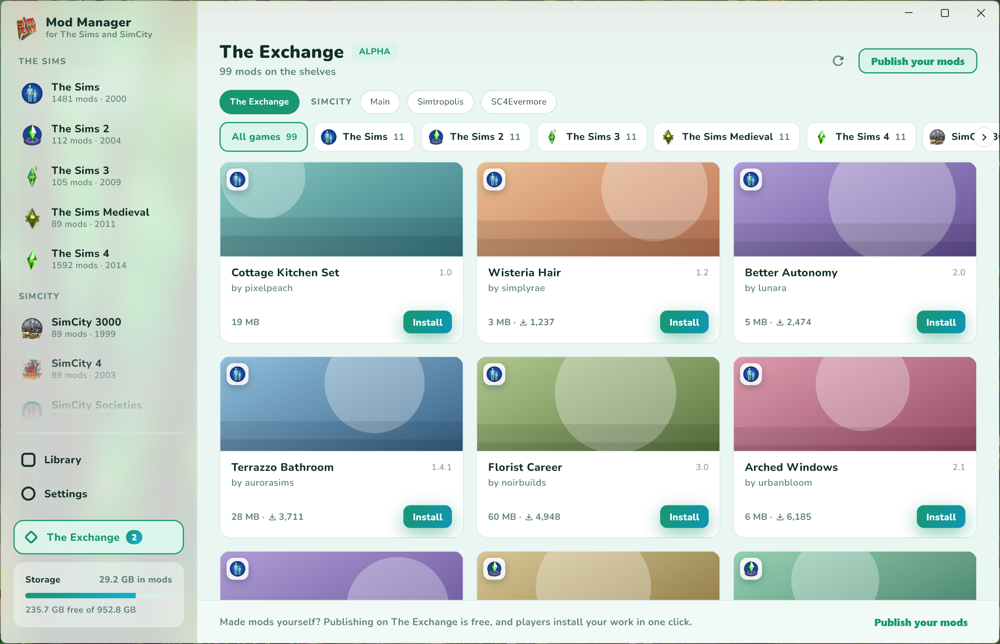
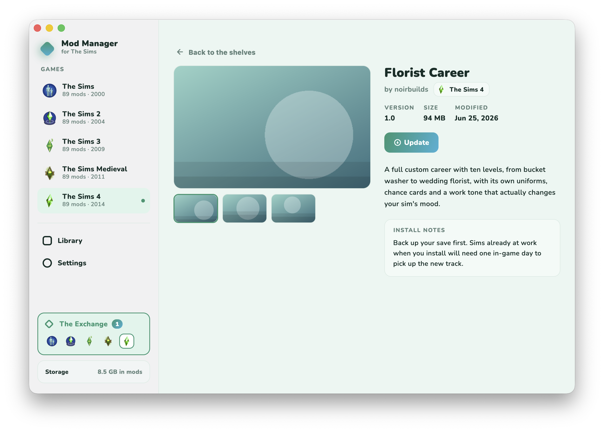
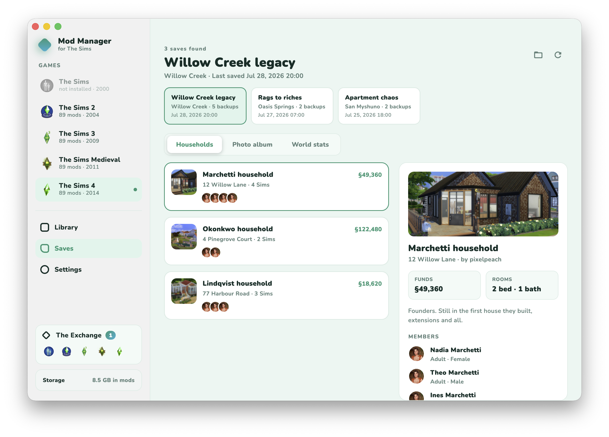
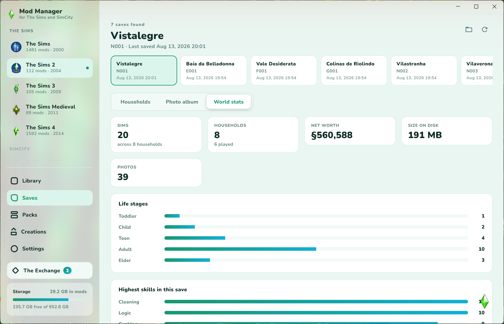
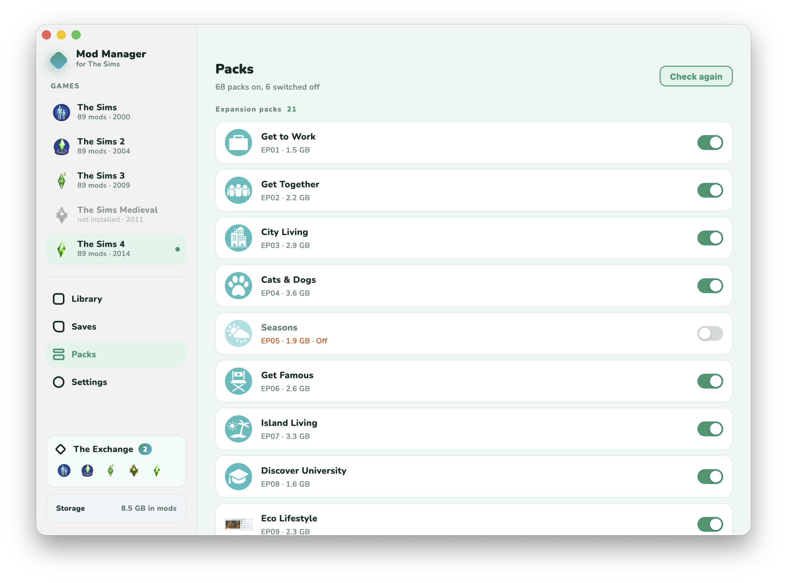

<div align="center">

# The Sims Mod Manager

**A free, cross-platform desktop mod manager for The Sims 1, 2, 3 & 4 and The Sims Medieval.**

[](https://github.com/rodrifelix99/TheSimsModManager/releases/latest)
[](https://github.com/rodrifelix99/TheSimsModManager/actions/workflows/release.yml)
[](https://github.com/rodrifelix99/TheSimsModManager/releases)
[](#download)
[](LICENSE.md)
[](https://www.paypal.com/donate/?hosted_button_id=UFSLDMGKB9R6A)

**[Visit the website →](https://thesimsmodmanager.web.app/)** · **[Follow on Tumblr](https://thesimsmodmanager.tumblr.com/)**

Browse, install, enable/disable, and clean up your mods and custom content
for every mainline Sims game (and The Sims Medieval), in one app, with a UI
that re-themes itself to match the game you're managing.



<sub>The UI re-themes per game. Here's the same library managing The Sims 2:</sub>



<sub>Every palette comes in a dark version too, following your system or your own pick:</sub>



</div>

## Features

- **Per-game themed UI**: the whole app re-tints as you switch between
  The Sims 1, 2, 3, 4 and Medieval, complete with the classic Sims 1 UI
  sounds, in light or dark.
- **Real thumbnails & insights**: `.package` files are parsed (DBPF) to
  pull out embedded artwork and a content breakdown (CAS parts, textures,
  tuning...), so your library looks like a library, not a file list.
- **Library** with search, category filters (Package/Script/Object/...),
  grid and list layouts, sorting by name, date or size (with the option to
  keep disabled mods at the bottom), and live
  Total/Enabled/Disabled/Conflicts stats.
- **One-click enable/disable**: disabling renames the file with a
  `.disabled` suffix so the game's loader skips it; nothing is ever deleted.
  You can pick the suffix yourself to match another manager, and mods
  something else disabled (CC Magic's `.off`) show up in the library too.
- **Conflict warnings**: enabled mods are badged when they share a file
  name, when two versions of the same mod are installed side by side, and
  when their packages actually share DBPF resource keys (the real thing:
  the game keeps whichever copy it loads last).
- **Finds your folders for you**: localized user folders
  ("Los Sims 3", "Die Sims 2", the Ultimate Collection), every install
  when a game exists more than once, and you can point at any folder
  manually.
- **Mods-folder scaffolding**: if a game has no mods folder yet, the app
  creates it *with the files the game needs* (e.g. the Sims 3
  `Resource.cfg` framework).
- **Install**: pick mod files (filtered to the game's real extensions)
  or drop files and folders straight onto the window; `.zip`, `.rar` and
  `.7z` archives are unpacked for you, keeping their folder structure and
  skipping readmes and screenshots.
- **The Exchange**: a mod shop inside the app. Browse the whole catalog,
  filter by game, install in one click, and get an Update button when a
  creator ships a new version of something you already have.
- **Saves**: read-only insight into your save files - households, funds,
  photo albums, and world stats like population, net worth, life stages
  and top skills, without opening the game.
- **Packs**: every expansion, game pack, stuff pack and kit installed
  next to the game, with its artwork and its size on disk. The Sims 4 and
  The Sims 3 can be switched off from here without moving a single file;
  nothing is ever uninstalled.

<div align="center">



<sub>A mod's detail view: what's inside the package, where the file lives, and why it got flagged.</sub>

</div>

## The Exchange

The app has its own mod shop, currently in alpha. Publishing is free at the
**[creator portal](https://thesimsmodmanager.web.app/portal/)**, and what you
publish shows up on everyone's shelves.

<div align="center">



<sub>The shelves, filtered by game. Installing puts the file in the folder of the game the listing names, whichever game you're currently looking at.</sub>



<sub>A listing brings its screenshots and install notes along, and turns into an Update button once the creator publishes a newer version.</sub>

</div>

## Saves

Read-only insight into your save files, no game launch required: every
household with its funds and members, a photo album, and world stats
(population, net worth, life stages, top skills). Support varies per game
by what each save format actually holds.

<div align="center">



<sub>Every save's households, backups included. Open one to see its funds, its house, and who's living there.</sub>



<sub>World stats for the whole save: population, net worth, life stages, even the highest skill in the save.</sub>

</div>

## Packs

The publisher's own content, listed beside your mods: expansions, game packs,
stuff packs and kits, each with its artwork, its code and what it takes up on
disk. Where a game has a safe way to run without one, there's a switch. The
Sims 4 writes the same `packstoskipmount` line its own Pack Selection screen
uses; The Sims 3 takes the pack out of the registry the launcher reads
(Windows, administrator rights); the Sims 2 switches sit behind an
experimental opt-in in Settings, because a neighborhood played with a pack can
break when it's opened without one. The Sims 1 merged its expansions into the
base game, so there the screen is a list. Either way nothing is moved or
uninstalled, and the game picks the change up on its next start.

<div align="center">



<sub>A pack you switch off stays installed; the game just stops loading it. Useful for a lighter game, or for finding out which pack a mod is really fighting with.</sub>

</div>

## Download

Grab the latest version from the
**[Releases page](https://github.com/rodrifelix99/TheSimsModManager/releases/latest)**. Free, no account needed.

| Platform | File | Notes |
| --- | --- | --- |
| **Windows** (installer) | `TheSimsModManager-x.y.z-windows-setup.exe` | Recommended. SmartScreen may warn (app isn't code-signed yet); choose *More info → Run anyway* |
| **Windows** (portable) | `TheSimsModManager-x.y.z-windows-portable.zip` | Extract anywhere, run `sims_mod_manager.exe` |
| **macOS** | `TheSimsModManager-x.y.z-macos.dmg` | Signed & notarized by Apple. Open it and drag the app into Applications |
| **Linux** | `TheSimsModManager-x.y.z-linux-x64.tar.gz` | Extract, run `sims_mod_manager` |

## Supported games

| Game | Default mods location | Notes |
| --- | --- | --- |
| The Sims | `<install>\The Sims\Downloads` | Lives in the install folder, not Documents |
| The Sims 2 | `Documents\EA Games\The Sims 2\Downloads` | Ultimate Collection uses its own folder name |
| The Sims 3 | `Documents\Electronic Arts\The Sims 3\Mods\Packages` | Needs the `Resource.cfg` framework; the app creates it for you |
| The Sims Medieval | `<install>\The Sims Medieval\Mods\Packages` | Lives in the install folder (Documents only holds saves); needs a `Resource.cfg` in the install root - the app creates it for you |
| The Sims 4 | `Documents\Electronic Arts\The Sims 4\Mods` | Created by the game on first launch; enable CC/script mods in game options |

All of these are best-effort defaults: every game's folder can be overridden
in Settings, which covers custom drives, localized folder names,
OneDrive-relocated Documents, and Wine/CrossOver prefixes on macOS/Linux.

The core is game-agnostic by design: support for the **SimCity** series (and
any other moddable game) can be added without touching the rest of the app.
See [docs/adding-a-game.md](docs/adding-a-game.md).

## Building from source

Requires the [Flutter SDK](https://docs.flutter.dev/get-started/install) with
desktop support enabled.

```sh
flutter pub get
flutter run -d windows   # or: -d macos / -d linux
```

Run the tests and analyzer with `flutter test` and `flutter analyze`.
More detail in [docs/architecture.md](docs/architecture.md).

## Languages

The app and the website speak eleven languages. English and Portuguese are
mine; the other nine were done by simmers who actually play in them, which
is why they use each scene's own modding slang instead of a dictionary
translation:

| Language | Translated by |
| --- | --- |
| English | rodrifelix99 |
| 简体中文 | xiaoyu_sims |
| Español | marisol_plumbob |
| Português (Brasil) | rodrifelix99 |
| Français | clodesims |
| Deutsch | plumbobjonas |
| Italiano | giuliapixel89 |
| Русский | verasimka |
| Polski | kasia_pxl |
| 日本語 | mochi_simjp |
| Ελληνικά | [friendofbellas](https://www.tumblr.com/friendofbellas) |

Spotted something that reads wrong in your language, or want to add one that
isn't here? The strings live in [lib/l10n](lib/l10n) (app) and
[web/src/i18n](web/src/i18n) (website) - open an issue or a PR, credit included.

## Contributing

Bug reports, feature ideas, and pull requests are very welcome; see
[CONTRIBUTING.md](.github/CONTRIBUTING.md). Good first stops:

- The **[Wiki](https://github.com/rodrifelix99/TheSimsModManager/wiki)**: user guide & FAQ
- The **[Tumblr blog](https://thesimsmodmanager.tumblr.com/)**: news & release announcements
- [docs/architecture.md](docs/architecture.md): how the app is put together
- [docs/adding-a-game.md](docs/adding-a-game.md): add support for a new game

## Thanks

A good chunk of this app exists because someone with more patience than me answered a question at a bad hour:

- **bunsenpixel**, who figured out that a macOS window keeps the material it was born with, so the blur has to be set inside `waitUntilReadyToShow` and not a frame later. Two evenings of staring at a solid white window, fixed in one message.
- **wanderbyte**, for spotting that bsdtar unpacks `.rar`/`.7z` through `\\?\` paths and then leaves behind names the normal Windows API can't reach again, which is why a single deep archive was taking whole installs down with it.
- **mothcache**, for the RefPack notes that got the DBPF parser reading compressed resources instead of shrugging at half the packages in my Mods folder.
- **plumbtreemods**, who knows exactly where every kind of Sims 1 file is meant to land, mesh-name prefixes for buyable clothing included. The Sims 1 routing rules are theirs, I only wrote them down in Dart.
- **hexley_j**, for the Inno Setup warning that stopped me changing the `AppId` and shipping an "upgrade" that installs itself a second time next to the old one.

And to everyone who reported a bug with a screenshot and their real folder layout attached: that saves more time than it looks like it does.

## Where AI fits in

Claude turns up in this repo's contributor list now and then. It writes comments, docstrings, and paragraphs like this one - the spots where "correct and clear" is the whole job since English and clear documentation is not native to me. It has never touched the DBPF parser, the sims3pack offset math, or the conflict detector; those are mine, line by line, and I can walk you through any of them if you ask. I don't merge code I can't explain myself, full stop. Longer version, with the two bugs that taught me why that matters: [Say no to vibe coding](https://www.tumblr.com/thesimsmodmanager/823165940293369856/say-no-to-vibe-coding).

## Roadmap

SimCity support · more games via the adapter system. See the
[open issues](https://github.com/rodrifelix99/TheSimsModManager/issues) for
what's planned and to suggest more.

## License & disclaimer

The source is available for reading and contributing, but this is **not** an
open-source license: the code may not be reused or redistributed. The app
itself is free to download and use. See [LICENSE.md](LICENSE.md).

> **The Sims Mod Manager is an unofficial fan project.** It is not affiliated
> with, endorsed by, or sponsored by Electronic Arts Inc. or Maxis. *The
> Sims*, *SimCity*, and all related logos, artwork, and sounds are trademarks
> or copyrighted material of Electronic Arts Inc. and are used here for
> identification and interoperability only.
